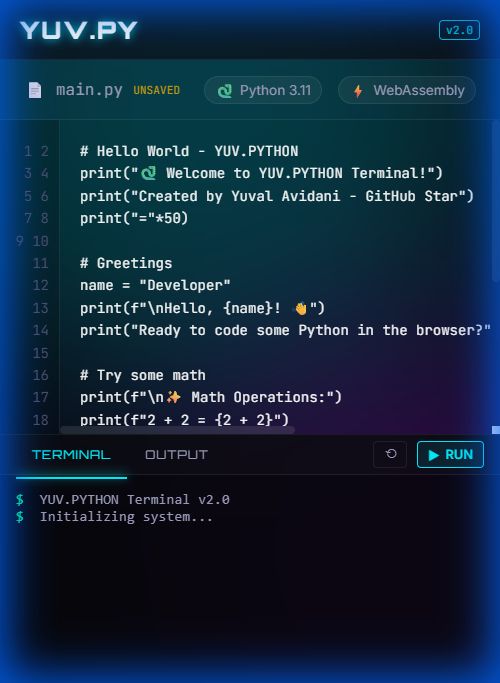

# 🐍 YUV.PYTHON Terminal - Python in Your Browser

> Execute Python code directly in your browser using WebAssembly. No installation, no backend, just pure Python power! 🚀

[](https://www.python.org/)
[](https://webassembly.org/)
[](https://opensource.org/licenses/MIT)
[](https://github.com/hoodini/yuv-python-terminal/stargazers)


## ✨ What is YUV.PYTHON Terminal?

YUV.PYTHON Terminal is a **futuristic, cyberpunk-themed web application** that lets you run Python code directly in your browser using WebAssembly technology powered by [Pyodide](https://pyodide.org/). No server required, no installation needed - just open the page and start coding!

**Created by [Yuval Avidani](https://yuv.ai)** - GitHub Star, AI Builder & Speaker

### 🎯 Perfect For:
- **Learning Python** - Great for beginners and students
- **Quick Prototyping** - Test Python code snippets instantly
- **Teaching** - Share interactive Python examples
- **Presentations** - Live coding demos without setup
- **Fun** - Experiment with Python anywhere, anytime!

## 🌟 Features

### 💻 Core Functionality
- ✅ **Full Python 3.11+ Support** - Complete Python runtime in your browser
- ✅ **Standard Library Access** - Use built-in modules like `math`, `sys`, `json`, etc.
- ✅ **Real-time Execution** - See results instantly
- ✅ **No Backend Required** - Everything runs client-side
- ✅ **Zero Installation** - Just open the page and start coding

### 🎨 Amazing UI/UX
- 🌌 **Animated Particle Background** - Floating particles with connected nodes
- 🎬 **Glitch Effects** - Cyberpunk-style title animations
- ⚡ **Neon Glow Effects** - Electric cyan and magenta accents
- 📺 **Scanline Effect** - Retro CRT monitor aesthetic
- 🎯 **Line Numbers** - Professional code editor with vertical line numbers
- 🎨 **Syntax Highlighting** - Neon-colored Python syntax highlighting
- 📝 **8 Code Templates** - Pre-loaded examples (Fibonacci, Sorting, OOP, etc.)
- 📱 **Mobile Responsive** - Works perfectly on all devices
- 🖱️ **Smooth Animations** - Polished hover effects and transitions

### ⌨️ Keyboard Shortcuts
- `Ctrl + Enter` or `Shift + Enter` - Execute code
- `Tab` - Insert 4 spaces (proper indentation)
- `Ctrl + /` - Comment/uncomment lines

## 🚀 Quick Start

### Option 1: Run Locally (Simplest)

1. **Clone or Download** this repository:
```bash
git clone https://github.com/hoodini/yuv-python-terminal.git
cd yuv-python-terminal
```

2. **Start a local web server**:

Using Python (easiest):
```bash
python -m http.server 8000
```

Using Node.js:
```bash
npx serve .
```

Using npm:
```bash
npm start
```

3. **Open your browser** and visit:
```
http://localhost:8000
```

### Option 2: Deploy Online

Deploy to **GitHub Pages**, **Netlify**, or **Vercel** for free:

- Just upload all files
- Set `index.html` as the main page
- Your Python terminal is live! 🎉

## 📖 How to Use

### For Beginners:

1. **Open the Application** - Load the page in your browser
2. **Try a Template** - Click any code template button to load example code
3. **Click "EXECUTE"** - This loads Python (first time takes 2-5 seconds)
4. **Write Code** - Type Python code in the left panel or modify templates
5. **Run It** - Click "EXECUTE" again or press `Ctrl+Enter`
6. **See Results** - Output appears in the right terminal panel

### 📝 Built-in Code Templates:

YUV.PYTHON comes with 8 ready-to-run Python examples:

- 👋 **Hello World** - Get started with basics
- 🔢 **Fibonacci** - Sequence generation with generators
- 📊 **Sorting** - Bubble sort, quick sort, and built-in sorting
- 🗂️ **Data Structures** - Stacks, queues, dictionaries, sets
- ✨ **Decorators** - Function decorators and caching
- 🎯 **Comprehensions** - List, dict, set, and generator comprehensions
- 🏗️ **Classes & OOP** - Object-oriented programming
- ⚡ **Generators** - Memory-efficient iteration

Click any template to instantly load and run professional Python code!

### Example Code to Try:

```python
# Hello World
print("Hello from Python in the browser!")

# Math Operations
import math
print(f"Pi: {math.pi}")
print(f"Square root of 16: {math.sqrt(16)}")

# List Comprehension
squares = [x**2 for x in range(10)]
print(f"Squares: {squares}")

# Function Definition
def fibonacci(n):
    a, b = 0, 1
    for _ in range(n):
        print(a, end=' ')
        a, b = b, a + b
    print()

fibonacci(10)
```

## 🖼️ Screenshots

### Main Interface


### Code Execution


### Mobile View


### Dark Theme Details


## 🛠️ Technology Stack

- **Frontend**: HTML5, CSS3, JavaScript (Vanilla)
- **Python Runtime**: [Pyodide](https://pyodide.org/) (Python compiled to WebAssembly)
- **Fonts**:
  - [Orbitron](https://fonts.google.com/specimen/Orbitron) - Futuristic headlines
  - [JetBrains Mono](https://fonts.google.com/specimen/JetBrains+Mono) - Code editor
- **Design**: Custom cyberpunk theme with neon effects

## 🎨 Design Philosophy

The UI was designed with a **cyberpunk terminal aesthetic**:
- Deep black backgrounds with neon cyan (#00fff9) and magenta (#ff00ff)
- Animated particle system for depth
- Glitch effects for that hacker vibe
- Smooth animations for modern feel
- Mobile-first responsive design

## 📱 Mobile Support

The app is **fully responsive** and works great on:
- 📱 Smartphones (iOS & Android)
- 📱 Tablets
- 💻 Laptops
- 🖥️ Desktop computers

On mobile devices, use the floating toggle button to switch between editor and terminal views.

## 🔧 Customization

### Change Colors
Edit the CSS variables in `styles.css`:
```css
:root {
    --cyan: #00fff9;
    --magenta: #ff00ff;
    --bg-dark: #0a0e17;
    /* Add your colors here */
}
```

### Modify Particles
Edit particle count and behavior in `app.js`:
```javascript
const particleCount = 80; // Change number of particles
```

## ⚡ Performance

- **First Load**: 2-5 seconds (downloads Python runtime ~6MB)
- **Subsequent Runs**: Instant execution
- **Memory Usage**: ~50-100MB (runs in browser)
- **Speed**: Near-native Python performance

## 🤝 Contributing

Contributions are welcome! Feel free to:
- 🐛 Report bugs
- 💡 Suggest features
- 🔧 Submit pull requests
- ⭐ Star this repository

## 📄 License

MIT License - Feel free to use this project for anything!

## 🌟 Creator

Created with ❤️ by **Yuval Avidani**

**AI Builder & Speaker | Founder of YUV.AI**
- 🌟 GitHub Star
- ☁️ AWS Gen AI Superstar

### Connect with Me:
- ⭐ GitHub: [@hoodini](https://github.com/hoodini)
- 🌟 GitHub Stars Profile: [stars.github.com/profiles/hoodini](https://stars.github.com/profiles/hoodini/)
- 🌐 Homepage: [yuv.ai](https://yuv.ai)
- 💼 LinkedIn: [Yuval Avidani](https://www.linkedin.com/in/%F0%9F%8E%97%EF%B8%8Fyuval-avidani-87081474/)
- 𝕏 Twitter: [@yuvalav](https://twitter.com/yuvalav)
- 📸 Instagram: [@yuval_770](https://instagram.com/yuval_770)
- 🔗 More Links: [linktr.ee/yuvai](https://linktr.ee/yuvai)

**Want to build amazing AI projects? Let's connect!**

## 🙏 Acknowledgments

- [Pyodide](https://pyodide.org/) - For making Python in the browser possible
- [WebAssembly](https://webassembly.org/) - For the amazing technology
- The Python Community - For creating an amazing language

## 📚 Learn More

- [Pyodide Documentation](https://pyodide.org/en/stable/)
- [WebAssembly Docs](https://webassembly.org/)
- [Python Documentation](https://docs.python.org/)

---

⭐ **If you found this useful, please star this repository!** ⭐

Made with 💙 using Python, WebAssembly, and lots of neon lights! ✨
